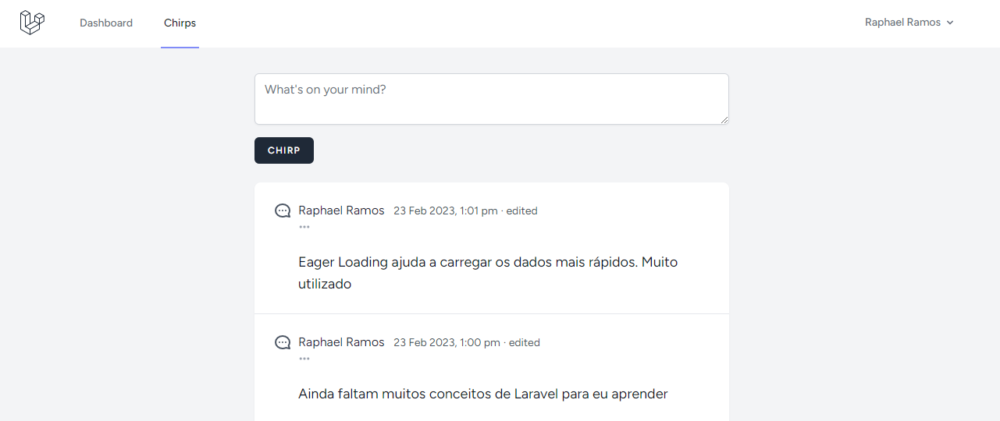

# Laravel bootcamp

This is a microblogging platform called Chirper where users can sign up and post everything they want

## Routing

The plataform main routes are shown below

| **Verb**  | **URI**           | **Action** | **Route Name** |
|-----------|-------------------|------------|----------------|
| GET       | `/chirps`         | index      | chirps.index   |
| POST      | `/chirps`         | store      | chirps.store   |
| PUT/PATCH | `/chirps/{chirp}` | update     | chirps.update  |
| DELETE    | `/chirps/{chirp}` | destroy    | chirps.destroy |
